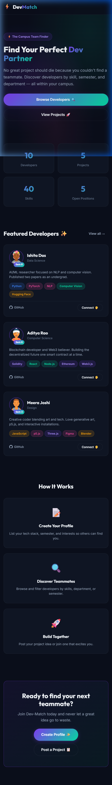
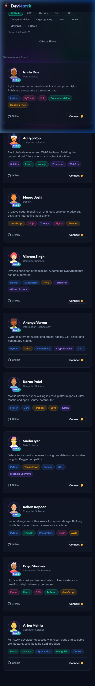
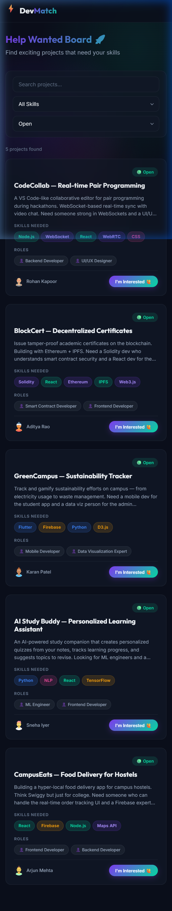
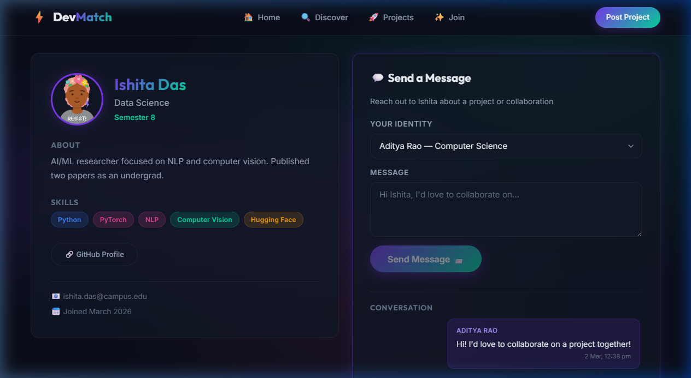

# ⚡ Dev-Match — The Internal Team Finder

> **Tinder for Developers inside the campus.** Find teammates by skill, semester, and department — so no great project idea dies because you couldn't find a partner.



---

## 🚀 Features

- **Skill Profiles** — Students list their tech stack, bio, semester, and interests
- **Help Wanted Board** — Post projects like *"Building a SaaS, need 1 UI/UX designer and 1 Firebase expert"*
- **Filter System** — Search teammates by skill, semester, department, or name
- **Profile Detail & Messaging** — View any developer's full profile and send them a direct message
- **"I'm Interested" Flow** — Click on a project → land on the owner's profile → message them instantly

---

## 🖼️ Screenshots

| Home | Discover | Projects | Profile & Messaging |
|------|----------|----------|---------------------|
|  |  |  |  |

---

## 🛠️ Tech Stack

| Layer | Technology |
|-------|-----------|
| Frontend | React, Vite, React Router, Axios |
| Backend | Python, FastAPI, SQLAlchemy |
| Database | SQLite |
| Design | Glassmorphism, CSS Animations, Dark Theme |

---

## ⚡ Quick Start

### Prerequisites
- Python 3.9+
- Node.js 18+

### One-Command Start
```bash
python start.py
```

### Manual Start
```bash
# Backend (Terminal 1)
cd backend
pip install -r requirements.txt
python seed.py                    # Seed sample data
python -m uvicorn main:app --reload --port 8000

# Frontend (Terminal 2)
cd frontend
npm install
npm run dev
```

Open **http://localhost:5173** 🎉

---

## 📁 Project Structure

```
Dev-Match/
├── backend/
│   ├── main.py          # FastAPI app + routes
│   ├── models.py        # User, Project, Message tables
│   ├── schemas.py       # Pydantic validation models
│   ├── crud.py          # Database operations
│   ├── database.py      # SQLite setup
│   └── seed.py          # Sample data seeder
├── frontend/
│   └── src/
│       ├── api.js       # Axios API client
│       ├── components/  # Navbar, ProfileCard, ProjectCard, FilterPanel, SkillTag
│       └── pages/       # Home, Discover, CreateProfile, HelpWanted, PostProject, ProfileDetail
├── screenshots/         # App screenshots & demo recordings
├── start.py             # Cross-platform launcher
└── start.bat            # Windows launcher
```

---

## 📡 API Endpoints

| Method | Endpoint | Description |
|--------|----------|-------------|
| GET | `/api/users` | List/filter developers |
| POST | `/api/users` | Register a new developer |
| GET | `/api/users/:id` | Get developer profile |
| GET | `/api/projects` | List/filter projects |
| POST | `/api/projects` | Post a new project |
| GET | `/api/skills` | All distinct skills |
| GET | `/api/stats` | Platform statistics |
| POST | `/api/messages` | Send a message |
| GET | `/api/messages/:id` | Get user's messages |
| GET | `/api/messages/:id1/:id2` | Get conversation |

---

## 🌐 Deployment

### Backend → [Render](https://render.com) (Free Tier)

1. Go to [render.com](https://render.com) → **New +** → **Web Service**
2. Connect your GitHub repo (`MrDunky14/Dev-Match`)
3. Configure:

   | Setting | Value |
   |---------|-------|
   | **Root Directory** | `backend` |
   | **Runtime** | Python 3 |
   | **Build Command** | `pip install -r requirements.txt` |
   | **Start Command** | `uvicorn main:app --host 0.0.0.0 --port $PORT` |

4. Add environment variable:
   ```
   CORS_ORIGINS = https://your-frontend-url.vercel.app
   ```
5. Click **Deploy** → copy the URL (e.g. `https://dev-match-api.onrender.com`)

> 💡 **Seed the database** after first deploy: go to Render Shell and run `python seed.py`

---

### Frontend → [Vercel](https://vercel.com) (Free Tier)

1. Go to [vercel.com](https://vercel.com) → **Add New Project**
2. Import your GitHub repo (`MrDunky14/Dev-Match`)
3. Configure:

   | Setting | Value |
   |---------|-------|
   | **Root Directory** | `frontend` |
   | **Framework Preset** | Vite |
   | **Build Command** | `npm run build` |
   | **Output Directory** | `dist` |

4. Add environment variable:
   ```
   VITE_API_URL = https://dev-match-api.onrender.com/api
   ```
   *(Replace with your actual Render backend URL)*

5. Click **Deploy** 🚀

> ⚠️ After the frontend deploys, go back to Render and update `CORS_ORIGINS` with your Vercel URL.

---

### Alternative: Deploy Both on Render

If you prefer to keep everything on one platform:

**Backend** — same as above

**Frontend (Static Site):**
1. Render → **New +** → **Static Site**
2. Root Directory: `frontend`
3. Build Command: `npm install && npm run build`
4. Publish Directory: `dist`
5. Add env var: `VITE_API_URL = https://your-backend.onrender.com/api`

---

## 📡 API Endpoints

| Method | Endpoint | Description |
|--------|----------|-------------|
| GET | `/api/users` | List/filter developers |
| POST | `/api/users` | Register a new developer |
| GET | `/api/users/:id` | Get developer profile |
| GET | `/api/projects` | List/filter projects |
| POST | `/api/projects` | Post a new project |
| GET | `/api/skills` | All distinct skills |
| GET | `/api/stats` | Platform statistics |
| POST | `/api/messages` | Send a message |
| GET | `/api/messages/:id` | Get user's messages |
| GET | `/api/messages/:id1/:id2` | Get conversation |

---

## 👥 Team

Built for hackathons by campus developers who believe no good idea should die for lack of a teammate.
